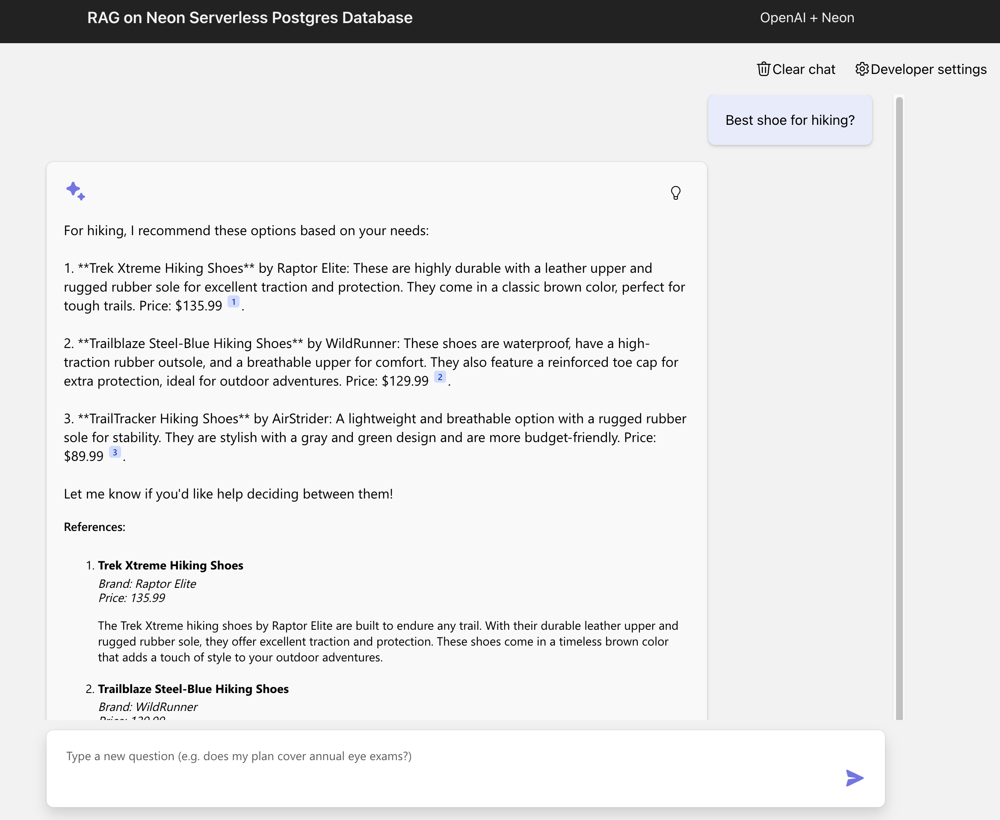

# RAG on Neon Serverless Postgres

[](https://codespaces.new/neondatabase-labs/rag-neon-postgres-openai-azure-python)
[](https://vscode.dev/redirect?url=vscode://ms-vscode-remote.remote-containers/cloneInVolume?url=https://github.com/neondatabase-labs/rag-neon-postgres-openai-azure-python)

This project creates a web-based chat application with an API backend that leverages OpenAI chat models to answer questions using [Neon Serverless Postgres](https://neon.tech/?refcode=44WD03UH). The frontend is built with React and FluentUI, while the backend is written in Python (FastAPI).

This project is designed for deployment on **Azure**, hosting:
- The app in **Azure Container Apps**
- The database in **Neon Serverless Postgres**
- AI models in **Azure OpenAI**

## Table of Content

* [Features](#features)
* [Getting started](#getting-started)
  * [GitHub Codespaces](#github-codespaces)
  * [VS Code Dev Containers](#vs-code-dev-containers)
  * [Local environment](#local-environment)
* [Deployment](#deployment)
* [Local development](#local-development)
* [Costs](#costs)
* [Security guidelines](#security-guidelines)
* [Guidance](#guidance)
* [Resources](#resources)

---

## Features

- **Hybrid search** on a **Neon database** table, combining:
  - **[pgvector](https://neon.tech/docs/extensions/pgvector) extension** for **vector search**
  - **Full-text search** for text-based ranking
  - **Reciprocal Rank Fusion (RRF)** for combining results
- **OpenAI function calling** to dynamically filter queries.
- **OpenAI embeddings** for efficient **RAG (Retrieval-Augmented Generation)**.



## Architecture diagram


## Azure Resources Used

| Service                     | Purpose                                      |
|-----------------------------|----------------------------------------------|
| **Neon Serverless Postgres**| Stores and queries structured data           |
| **Azure OpenAI**            | Embedding and chat models for RAG            |
| **Azure Container Apps**    | Deploys the API backend and frontend         |
| **Azure Container Registry**     | Stores and manages containerized images for frontend and backend        |
| **Azure Developer CLI**     | Automates deployment and resource management |
| **Azure Log Analytics**     | Monitors application logs and metrics        |


## Getting started

You have a few options for getting started with this template.
The quickest way to get started is GitHub Codespaces, since it will setup all the tools for you, but you can also [set it up locally](#local-environment).

### GitHub Codespaces

You can run this template virtually by using GitHub Codespaces. The button will open a web-based VS Code instance in your browser:

1. Open the template (this may take several minutes):

    [](https://codespaces.new/neondatabase-labs/rag-neon-postgres-openai-azure-python)

2. Open a terminal window
3. Continue with the [deployment steps](#deployment)

### VS Code Dev Containers

A related option is VS Code Dev Containers, which will open the project in your local VS Code using the [Dev Containers extension](https://marketplace.visualstudio.com/items?itemName=ms-vscode-remote.remote-containers):

1. Start Docker Desktop (install it if not already installed)
2. Open the project:

    [](https://vscode.dev/redirect?url=vscode://ms-vscode-remote.remote-containers/cloneInVolume?url=https://github.com/neondatabase-labs/rag-neon-postgres-openai-azure-python)

3. In the VS Code window that opens, once the project files show up (this may take several minutes), open a terminal window.
4. Continue with the [deployment steps](#deployment)

### Local Environment

1. Make sure the following tools are installed:

- [Azure Developer CLI (azd)](https://aka.ms/install-azd)
- [Node.js 18+](https://nodejs.org/download/)
- [Python 3.9+](https://www.python.org/downloads/)
- [Git](https://git-scm.com/downloads)

2. Clone this repository locally or fork it to your Github account.

    ```shell
    git clone https://github.com/neondatabase-labs/rag-neon-postgres-openai-azure-python
    ```

3. Open the project folder

    ```shell
    cd rag-neon-postgres-openai-azure-python
    ```
- (Optional)Create a Virtual Environment and activate it

    ```bash
    python3 -m venv .venv
    ```
    
    For Mac OS

    ```bash
    source .venv/bin/activate
    ```

    For Windows

    ```bash
    .\.venv\Scripts\activate
    ```

4. Install required Python packages and backend application:

    ```shell
    pip install -r requirements-dev.txt
    pip install -e src/backend
    ```

5. Continue with the [deployment steps](#deployment)

## Deployment

Once you've opened the project in [Codespaces](#github-codespaces), [Dev Containers](#vs-code-dev-containers), or [locally](#local-environment), you can deploy it to Azure.

1. Sign in to your Azure account:

    ```shell
    azd auth login
    ```

    For GitHub Codespaces users, if the previous command fails, try:

   ```shell
    azd auth login --use-device-code
    ```

2. Create a new azd environment:

    ```shell
    azd env new
    ```

    This will create a folder under `.azure/` in your project to store the configuration for this deployment. You may have multiple azd environments if desired.

3. (Optional) If you would like to customize the deployment to [use existing Azure resources](docs/deploy_existing.md), you can set the values now.

4. Provision the resources and deploy the code:

    ```shell
    azd up
    ```

    You will be asked to enter your `userPrincipalName` like your email address (e.g. jane.doe@contoso.com), select two locations, first a region for most of the resources, then a region specifically for the Azure OpenAI models. This project uses the gpt-4o-mini and text-embedding-ada-002 models which may not be available in all Azure regions. Check for [up-to-date region availability](https://learn.microsoft.com/azure/ai-services/openai/concepts/models#standard-deployment-model-availability) and select a region accordingly.

5. Set Neon database credentials to Azure environment and redeploy

    Currently, Neon does not support managed identity and automatically assigning database credentials during the deployment. After the first deployment, you need to retrieve  credentials manually from the Neon Console and set environment variable values

    1. Obtain Neon Database Credentials
       - From [Azure portal](https://portal.azure.com/), find the Neon Serverless Postgres Organization service and click on Portal URL.
       - This brings you to the **[Neon Console](https://console.neon.tech/?refcode=44WD03UH)** 
       - Click “New Project”
       - Choose an Azure region
       - Give your project a name (e.g., “Neon RAG Python”)
       - Click “Create Project”
       - Once the project is created successfully, copy the Neon connection string. You can find the connection details in the Connection Details widget on the Neon Dashboard.

       ```ini
       postgresql://[user]:[password]@[neon_hostname]/[dbname]?sslmode=require
       ```

    2. Set environment variable values for NeonDB

       Use the following commands to set your credentials:

       ```ini
       azd env set POSTGRES_HOST [neon_hostname]
       azd env set POSTGRES_USERNAME [user]
       azd env set POSTGRES_PASSWORD [password]
       azd env set POSTGRES_DATABASE [dbname]
       azd env set POSTGRES_SSL require
       ```

       After this, redeploy your app, and it will be connected to the Neon database.

    3. Run `azd deploy` to update these values in the Azure Container App

## Local Development

### Setting up the environment file

1. Obtain Neon Database Credentials
   - From [Azure portal](https://portal.azure.com/), find the Neon Serverless Postgres Organization service and click on Portal URL.
   - This brings you to the **[Neon Console](https://console.neon.tech/?refcode=44WD03UH)** 
   - Click “New Project”
   - Choose an Azure region
   - Give your project a name (e.g., “Neon RAG Python”)
   - Click “Create Project”
   - Once the project is created successfully, copy the Neon connection string. You can find the connection details in the Connection Details widget on the Neon Dashboard.

   ```ini
   postgresql://[user]:[password]@[neon_hostname]/[dbname]?sslmode=require
   ```

3. Store NeonDB Credentials in `.env`
   - Copy `.env.sample` to `.env` and update:
   ```ini
   POSTGRES_HOST=[neon_hostname]
   POSTGRES_USERNAME=[user]
   POSTGRES_PASSWORD=[password]
   POSTGRES_DATABASE=[dbname]
   POSTGRES_SSL=require
   ```

4. Set Azure OpenAI deployed values

   Since the local app uses OpenAI models, you should first deploy it for the optimal experience.
   
   - To use Azure OpenAI, set `OPENAI_CHAT_HOST` and `OPENAI_EMBED_HOST` to "azure". Then fill in the values of `AZURE_OPENAI_ENDPOINT` and    `AZURE_OPENAI_CHAT_DEPLOYMENT` based on the deployed values. You can display the values using this command:
   
       ```shell
       azd env get-values
       ```
   
   - To use OpenAI.com OpenAI, set `OPENAI_CHAT_HOST` and `OPENAI_EMBED_HOST` to "openai". Then fill in the value for `OPENAICOM_KEY`.
   - To use Ollama, set `OPENAI_CHAT_HOST` to "ollama". Then update the values for `OLLAMA_ENDPOINT` and `OLLAMA_CHAT_MODEL` to match your local setup and   model. We recommend using "llama3.1" for the chat model, since it has support for function calling, and "nomic-embed-text" for the embedding model, since the sample data has already been embedded with this model. If you cannot use function calling, then turn off "Advanced flow" in the Developer Settings. If you cannot use the embedding model, then turn off vector search in the Developer Settings.

### Running the frontend and backend

1. Run these commands to install the web app as a local package (named `fastapi_app`), set up the local database, and seed it with test data:

    ```bash
    python -m pip install -r src/backend/requirements.txt
    python -m pip install -e src/backend
    python ./src/backend/fastapi_app/setup_postgres_database.py
    python ./src/backend/fastapi_app/setup_postgres_seeddata.py
    ```

2. Build the frontend:

    ```bash
    cd src/frontend
    npm install
    npm run build
    cd ../../
    ```

    There must be an initial build of static assets before running the backend, since the backend serves static files from the `src/static` directory.

3. Run the FastAPI backend (with hot reloading). This should be run from the root of the project:

    ```shell
    python -m uvicorn fastapi_app:create_app --factory --reload
    ```

    Or you can run "Backend" in the VS Code Run & Debug menu.

4. Run the frontend (with hot reloading):

    ```bash
    cd src/frontend
    npm run dev
    ```

    Or you can run "Frontend" or "Frontend & Backend" in the VS Code Run & Debug menu.

5. Open the browser at `http://localhost:5173/` and you will see the frontend.

## Costs

Pricing may vary per region and usage. Exact costs cannot be estimated.

* Neon Serverless Postgres: Free US$0.00/month, free plan includes 10 projects, 0.5 GB storage, 190 compute hours, autoscaling up to 2 CU, read replicas, 90+ Postgres extensions including pgvector extension.

You may try the [Azure pricing calculator](https://azure.microsoft.com/pricing/calculator/) for the resources below:

* Azure Container Apps: Pay-as-you-go tier. Costs based on vCPU and memory used. [Pricing](https://azure.microsoft.com/pricing/details/container-apps/)
* Azure OpenAI: Standard tier, GPT and Ada models. Pricing per 1K tokens used, and at least 1K tokens are used per question. [Pricing](https://azure.microsoft.com/pricing/details/cognitive-services/openai-service/)
* Azure Monitor: Pay-as-you-go tier. Costs based on data ingested. [Pricing](https://azure.microsoft.com/pricing/details/monitor/)

## Security guidelines

This template uses [Managed Identity](https://learn.microsoft.com/entra/identity/managed-identities-azure-resources/overview) for authenticating to the Azure services used such as Azure OpenAI.

Additionally, we have added a [GitHub Action](https://github.com/microsoft/security-devops-action) that scans the infrastructure-as-code files and generates a report containing any detected issues. To ensure continued best practices in your own repository, we recommend that anyone creating solutions based on our templates ensure that the [Github secret scanning](https://docs.github.com/code-security/secret-scanning/about-secret-scanning) setting is enabled.

## Guidance

Further documentation is available in the `docs/` folder:

* [Understanding the RAG flow](docs/rag_flow.md)
* [Customizing the data](docs/customize_data.md)
* [Deploying with existing resources](docs/deploy_existing.md)
* [Monitoring with Azure Monitor](docs/monitoring.md)
* [Evaluation](docs/evaluation.md)

Please post in the issue tracker with any questions or issues.

## Resources

* [Neon API for programmatic database management](https://neon.tech/docs/reference/api-reference)
* [RAG chat with Azure AI Search + Python](https://github.com/Azure-Samples/azure-search-openai-demo/)
* [Develop Python apps that use Azure AI services](https://learn.microsoft.com/azure/developer/python/azure-ai-for-python-developers)

🚀 **Start Building AI-Powered RAG with Neon Today!** 🚀
